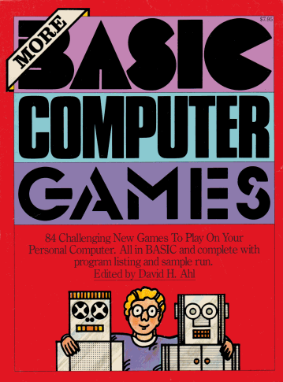
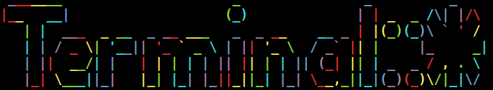
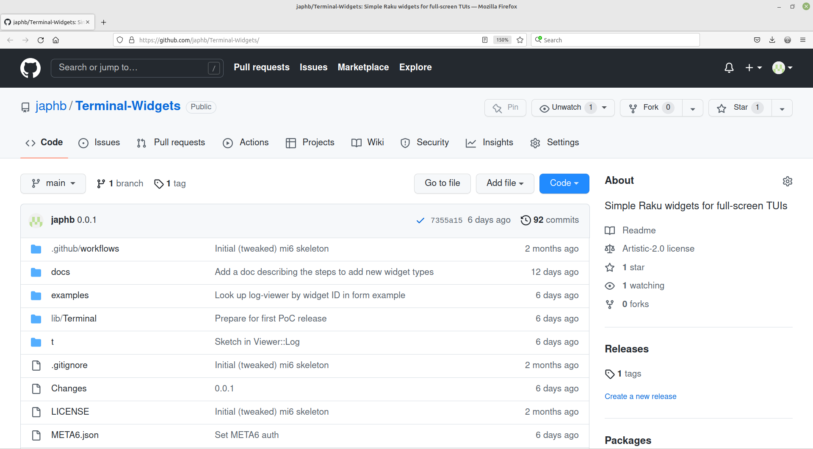

% Retro Cool Raku
% Geoffrey Broadwell; [**gjb@sonic.net**](mailto:gjb@sonic.net); `japhb` on [GitHub](https://github.com/japhb) and [`irc.libera.chat`](ircs://irc.libera.chat:6697)

##

*My Journey To Terminal::\**

::: notes
Accessibility note: The visible portion of this presentation is mostly images,
with only a small amount of text.  However, all of the image descriptions
should be captured in the image *titles* (sadly **NOT** the alt text, which
would be traditional, because of weird alt text behavior in the slide viewer
app) and in the slide notes, which pretty much include my full slide-by-slide
planned script.

(I babbled a bit more when I actually did the recording, but the script in
these "speaker notes" should contain enough to follow along pretty well.)
:::

# History

##

::: notes
The first computers I got to play with used TeleVideo terminals; pure text,
but a decent keyboard and display for all that.

Image credit: [Techopedia on Pinterest](https://www.pinterest.com/pin/32651166019537719/)
:::

##

::: notes
I had these BASIC Computer Games books, which included lots of games
*you could type in yourself*

Image credit: [DigiBarn Computer Museum](https://www.digibarn.com/collections/books/basicgames/)
Image credit: [Coding Horror Blog](https://blog.codinghorror.com/content/images/uploads/2008/04/6a0120a85dcdae970b0120a86ddf1c970b-pi.png)
:::

##

::: notes
... including this one, named "Super Star Trek" and so lengthy that they had to
typeset it in a small font to fit it all in; what you see there is just the first
page of many.

Image credit: [The Register](https://www.theregister.com/Print/2013/05/03/antique_code_show_star_trek/)
:::

##

::: notes
Here's what a long-range scan of the galaxy looked like in Super Star Trek (or
one of its many variants, anyway).

Note that the galaxy is 2D and rectangular.  This is actually why I became a
programmer in the first place -- I desperately wanted to make the SST galaxy
shape more realistic.  (I eventually made it an incredibly crude spiral galaxy
and by then I was thoroughly hooked.)

Image credit: [myabandonware.com](https://www.myabandonware.com/game/super-star-trek-2et)
:::

##

::: notes
During this time I played some of the classic Z-machine Interactive Fiction
titles from Infocom.

Image credit: [Retro Treasures](http://retro-treasures.blogspot.com/2017/06/14-wonderful-infocom-games.html)
:::

##

::: notes
This is the opening gameplay from the very first one, Zork, itself based on
a slightly earlier mainframe game, Colossal Cave Adventure.

I was terrible at these -- turns out my brain just isn't as twisty as the
average Infocom game designer -- but the idea of a game implemented in
just a few kilobytes that could *understand English sentences* AND work on
just about every home computer platform in existence blew me away.

Image credit: [TerraTempest on EmuParadise](https://www.emuparadise.me/Abandonware_Games/Zork_The_Great_Underground_Empire_(1980)(Infocom)/95759)
:::

##

::: notes
At some point during all this I learned Logo, which had the magic of turning
simple words and abbreviations into "turtle graphics" ...

Image credit: [Wikipedia](https://en.wikipedia.org/wiki/File:IBM_LCSI_Logo_Circles.png)
:::

##

::: notes
... and acquired a TRS-80 Color Computer (CoCo) ...

Image credit: [Wikipedia](https://en.wikipedia.org/wiki/File:TRS-80_Color_Computer_1_4x3.jpg
)
:::

##

::: notes
... which had this game on it, Dungeons of Daggorath.

This game was so far ahead of its time that its features weren't available
in other games for years, and didn't become normal/expected for at least a
*decade*.

It was a 2.5D first-person graphical game, with real-time play, real-time
lighting and sound that actually mattered for gameplay, five dungeon
levels, numerous items and monsters, English command parsing, actual tactics
required for success, and a firm "dungeon survival horror" vibe.

It was written in just **8KiB** of code and data.  To this day it remains
to me the pinnacle of constrained-environment game-writing genius.

Image credit: [I'm a CoCo Nut](http://imacoconut.com/dungeons-of-daggorath/)
:::

##

::: notes
At a family friend's house I saw this game, Prince of Persia, in the original
Apple II incarnation.  Even the "cleaned up" DOS version seen here made it
abundantly clear that great game play didn't need a ton of pixels or lots of
colors.

Prince of Persia was an incredible game because it made great use of what it
had to work with, not because it was running on blazing fast hardware.

Image credit: [GamesReplay.net](https://www.gamesreplay.net/gr/download/prince-of-persia-doswin/)
:::

##

::: notes
Years went by, and I learned increasingly advanced graphics coding and used
it to investigate game engines and write toys like Doom level viewers.

(Side note for anyone who likes to play with such things: Doom levels as they
exist on disk have matching cracks in the floors and ceilings, because the file
format took advantage of a *bug in the renderer* that didn't notice those
cracks to save a little space.  There are ways to fix those so modern renderers
are not confused, but that wasn't what I was trying to learn at the time.)
:::

##

::: notes

When new capabilities and techniques hit the open market, I was reading
everything I could about them.  This picture shows just part of *one* of my
graphics bookshelves, so you can get an idea of the magnitude of my graphics
book habit.  Once OpenGL came to the average desktop, I was completely in
love with the potential available to me.

I discovered a problem though.  The more advanced the graphics, the more
advanced (and voluminous!) the content has to be to make use of it, and
that curve is *very* unfriendly to a hobbyist wanting to do cutting-edge
graphics in their spare time and on a tight budget.
:::

##

::: notes
So I went back to the past.  The games that inspired me so much when I was
growing up?  Maybe I could make more like those!

**First row**
Image credit: [Grid Sage Games](https://www.gridsagegames.com/blog/2020/02/traditional-roguelike/)
Image credit: [Retro Treasures](http://retro-treasures.blogspot.com/2017/06/14-wonderful-infocom-games.html)
Image credit: [myabandonware.com](https://www.myabandonware.com/game/super-star-trek-2et)

**Second row**
Image credit: [I'm a CoCo Nut](http://imacoconut.com/dungeons-of-daggorath/)
Image credit: [GamesReplay.net](https://www.gamesreplay.net/gr/download/prince-of-persia-doswin/)
Image credit: [dailymotion](https://www.dailymotion.com/video/x28w1k0)
:::

# Meanwhile ...

##

::: notes
I learned lots of different computer languages over the years (okay decades),
but none really inspired me until Perl came along.

Image credit: [Learning-Perl.com](https://www.learning-perl.com/)
:::

##

::: notes
I started doing everything in Perl, including writing 3D engines in it.
Remember that Doom level viewer?  That was written in Perl.

I found ways to sneak it into my day job, and then got a day job that
focused on Perl.
:::

##

::: notes
After a few years, the rough edges started to get to me ... but by then Raku
(known as Perl 6 back then) was a thing, and Audrey Tang was leading the PUGS
team and teaching us all about -Ofun and radical commit trust and such.

Audrey is high on my list of "ridiculously cool people", by the way.  Look them
up if you want to be humbled.

Image credit: Camille McOuat via [CitizenLab](https://www.citizenlab.co/blog/civic-engagement/pioneers-1-audrey-tang-taiwans-digital-minister/)
:::

##

::: notes
After PUGS came Rakudo, and eventually it became good enough that I was able
to switch all of my fun coding over to the butterfly.

Image credit: Larry Wall, via [marketing.raku.org](https://marketing.raku.org/)
:::

##

::: notes
I had written OpenGL bindings for Parrot (the first Rakudo VM) and was writing
or porting little graphics demos to test those bindings (that's a screenshot
from a stress test ported from one of my Perl engines), but about the time
Rakudo began moving to MoarVM I was catching the retro computing bug.
:::

##

::: notes
Thankfully, so were a lot of other people, many of whom were working on
bringing the basic terminal emulator into this century, with full color and
Unicode glyph and emoji rendering.  Soon this kind of thing was possible.
That's a mockup I did of an RPG character creator UI.  Yes, that's all text.

Problem was, *Raku didn't know how to do that*.  Sure, you could do it all
with bespoke code every time, but that violates several principles of good
programming.  Plus, ewww.
:::

# `Terminal::*`

##

::: notes
The solution has been years in the making: `Terminal::*`.
That's just shorthand for a rich Raku module namespace.
:::

##

  * `Terminal::ANSIColor`
  * *`Text::MiscUtils`*
  * `Terminal::QuickCharts`
  * `Terminal::Print`
  * `Terminal::ANSIParser`
  * `Terminal::LineEditor`
  * `Terminal::Widgets`

::: notes
Here's the actual collection of `Terminal` module distros that *I've* worked
on, each addressing a part of the problem space.  `Text::MiscUtils` is
technically outside the namespace, but it is very relevant for later modules.
:::

# `Terminal::ANSIColor`

##

::: notes
The first of these, `Terminal::ANSIColor`, is the oldest and most popular as
well.  Originally written by `tadzik`, it provides basic handling of the ANSI
SGR (Set Graphics Rendition) escape codes, also known as "ANSI colors".

`Terminal::ANSIColor` provided routines to add, strip, and parse SGR codes.
:::

##

::: notes
Modern terminal emulators support more colors, so I added support for them;
`Terminal::ANSIColor` could now understand 8-bit and 24-bit color schemes.
That's the core 6x6x6 8-bit color cube there.
:::

# `Text::MiscUtils`

##

* `Text::MiscUtils::English`

> ordinal names, pluralization

::: notes
`Text::MiscUtils` currently provides two groups of functionality.  The first
are some fairly trivial helper routines for doing English ordinals and plurals,
the kind of thing you need for making command-line tools just a little more
friendly.
:::

##

* `Text::MiscUtils::Layout`

> duospacing, wrapping, justifying, columnating

::: notes

The second is a group of text layout utility functions for calculating
Unicode-aware glyph widths, line wrapping, arrangement into fixed-width
columns, and evenly-spaced justified text.

All of the other layout functions are based on `duospace-width()`, the Unicode
display width routine, which starts off using `Terminal::ANSIColor`'s
`colorstrip()` to ignore any embedded ANSI SGR/color codes.
:::

##

::: notes
For tasks like calculating and rendering static character sheets for running an
RPG, `Terminal::ANSIColor` and `Text::MiscUtils` are just the ticket -- they do
what you need without much extra fuss.

(The character sheets shown in the picture are from a homebrew system that I
work on occasionally, and they helped me investigate how different power levels
would pan out for NPCs.)

Still, doing anything graphical or animated with *only* these modules would be
an exercise in doing things the hard way.
:::

# `Terminal::QuickCharts`

##

::: notes
I created `Terminal::QuickCharts` out of frustration with the abysmal-but-easy
CLI graphing technique known as "asterisk plots".
:::

##

::: notes
`Terminal::QuickCharts` builds on `Terminal::ANSIColor` plus the Unicode
block-drawing glyphs to make something a little nicer.

It may be hard to see over the stream, but those bars don't line up exactly
with the text boundaries; that's because they use horizontal one-eighth-width
Unicode blocks to be much more precise about exact lengths.  It's probably
easiest to see for the top two bars, whose ends line up partway through the 'e'
and halfway through the space above them.
:::

##

::: notes
I like to write game engines, so I needed a way to visualize frame times in my
games.  I added that too, with some color coding to make it easy to understand
at a glance.  And of course it uses the vertical version of those one-eighth
sized Unicode blocks to be more precise in less space.

(That's fake data generated by one of the example programs by the way, not a
real run.)
:::

##

::: notes
Sometimes you've got a *lot* of data points, and you're not sure about the
value range, and you just want to get a general idea of the shape by dumping
it all into a smoke chart.  `Terminal::QuickCharts` does that too, using the
Unicode half-block "super-pixels".

This one *is* real data -- it's the runtime of a CSV parsing benchmark during
several phases of Rakudo optimization.

Data credit: [`[Tux]` on #raku-dev](https://irclogs.raku.org/raku-dev/2022-07-29.html#14:44)
:::

# `Terminal::Print`

##

::: notes
As nice as it can be for simple static charts, `Terminal::QuickCharts` is more
or less for basic CLI tools; it focuses more on Whipuptitude than Manipulexity,
as Larry would say.  Thankfully `ab5tract` had started on a better solution for
the full-screen TUI space.
:::

##

::: notes
Given my interest in games, graphics, and animation, I added a bunch of
animation-friendly bits to `ab5tract`'s original creation.  Want to write
your own old-school twitch game?  You can do that.
:::

##

::: notes
Want to explore fractals?  You can do that.

I cheated a bit here.  The font size is set really small, and the terminal was
full-screened on a large monitor.  But that's what I do when I'm playing with
fractals, so at least it's accurate cheating.  :-)
:::

##

::: notes
Want to do video game effects animations?  You can do that too.

The numbers in the upper right of two of the animations are currently active
particle counts for the particle systems being animated.
:::

##

::: notes
If you're sufficiently motivated, you could even simulate a roguelike UI
... and yes, even that example ships in the `Terminal::Print` repo.  :-)
:::

##

::: notes
But that's all on the output side; the inputs in `rpg-ui` are just simulated
for demo purposes.  `Terminal::Print` *does* have basic raw input capabilities;
here it's showing the raw byte stream of cursor key escape codes.
:::

##

::: notes
It can even decode those escape sequences back into the keys that generated
them, including decoding mouse inputs.

Unfortunately, it's rather more work than you might think to produce a useful
interactive UI from just those bits (though some people have done so!)
:::

# `Terminal::ANSIParser`

##

::: notes
Time to create more modules.  It was clearly time for me to more fully
understand ANSI/VT terminal protocols and handle them *correctly*, not just
support a few features here and there with ad-hoc code.  The first task was
to implement the actual ANSI/VT state machine.

Image credit: Paul Flo Williams on [vt100.net](https://vt100.net/emu/dec_ansi_parser)
:::

##

::: notes
For this I wrote `Terminal::ANSIParser`.  It's a simple module, from the
outside at least.  Feed it bytes or codepoints pulled from raw TTY data
streams, and it will parse it into tokens, sequences, and VT strings.
:::

# `Terminal::LineEditor`

##

::: notes
With `Terminal::ANSIParser` in hand, next I wrote `Terminal::LineEditor`
because I hated the many limitations of Linenoise, and I wanted to be able to
create a proper Unicode-aware text input field.
:::

##

::: notes
I added support for `Terminal::LineEditor` in Rakudo, so you can use it as your
REPL line editor if you like.  It supports standard editing keys and scrolls
long lines, as seen here.
:::

##

::: notes

It supports masked (password) inputs, command history, infinite
undo-redo, atomic replace operations, and (very basic) tab-completion.

:::

##

::: notes
It's written in layers so that pieces of it can be reused, and to vigorously
separate concerns.  Starting from the bottom:

  * `EditableBuffer` -- Basic interface role for editable buffers of all sorts

  * `SingleLineTextBuffer` -- An `EditableBuffer` that knows how to apply
    simple insert/delete/replace operations at arbitrary positions/ranges,
    tracks a yank item (the most recently deleted text), and creates and
    manages undo/redo information to allow infinite undo

  * `SingleLineTextBuffer::Cursor` -- A cursor class that knows how to move
    around within a `SingleLineTextBuffer` without moving outside the content
    area, and knows whether edit operations should automatically adjust its
    position

  * `SingleLineTextBuffer::WithCursors` -- A wrapper of `SingleLineTextBuffer`
    that supports multiple simultaneous cursors, and handles automatically
    updating them appropriately whenever applying a basic edit operation

  * `SingleLineTextInput` -- An input field role that tracks its own insert
    position as an auto-updating cursor, and provides a range of edit methods
    that operate relative to the current insert position

  * `ScrollingSingleLineInput` -- A `SingleLineTextInput` that knows how to
    scroll within a limited horizontal display width to ensure that the insert
    position is always visible, no longer how long the input

  * `ScrollingSingleLineInput::ANSI` -- A further extension of
    `ScrollingSingleLineInput` that is aware of cursor position and movement
    using ANSI/VT escape codes

  * `CLIInput` -- A driver for `ScrollingSingleLineInput::ANSI` that deals with
    raw terminal I/O, detects terminal size and cursor position, supports a
    control key map for common edit operations, and handles suspend/resume
    without corrupting terminal state
:::

# `Terminal::Widgets`

##

**Requirements**

  * Low latency and visually smooth updates
  * Live-resizable automatic constraint-driven layout
  * Full support for forms, graphs, and custom widgets
  * Easy to understand, familiar programming model
  * Make easy things easy, and hard things possible

::: notes
`Terminal::LineEditor` was a huge step in terms of functionality and
correctness, and I felt it was time to implement a real TUI widget library.
My requirements were a tall order.
:::

##

::: notes
In mid-July (2022) I was finally able to release the very first bits.
It builds heavily on all those previous `Terminal::*` modules.
:::

##

::: notes
Of course, it does forms ...
:::

##

::: notes
... and the code to do it isn't that bad even at this early stage.
:::

##

::: notes
It can do more complex business interfaces of course.

That's a project-based time tracker for consultants, lawyers, independent
contractors, and other folks that need to be able to invoice time accurately.
:::

##

<video data-autoplay src="new-ui.mp4"></video>

::: notes
And it finally lets me turn the `rpg-ui` simulation into something with real
interactivity (though it's still a demo).

This video shows basic mouse and keyboard interactivity, including separate
widgets affecting each other's state and the global game state.
:::

# Onward!

##

[github.com/Raku-MUGS](https://github.com/Raku-MUGS)

::: notes
All of this let me get back to my hobby: writing games!  And for that, I
returned to the project that I put on pause to work on those last several
modules: [MUGS: Multi-User Gaming Services](https://github.com/Raku-MUGS).
But that's a separate talk, for another day.  :-)
:::

# Thank You!
